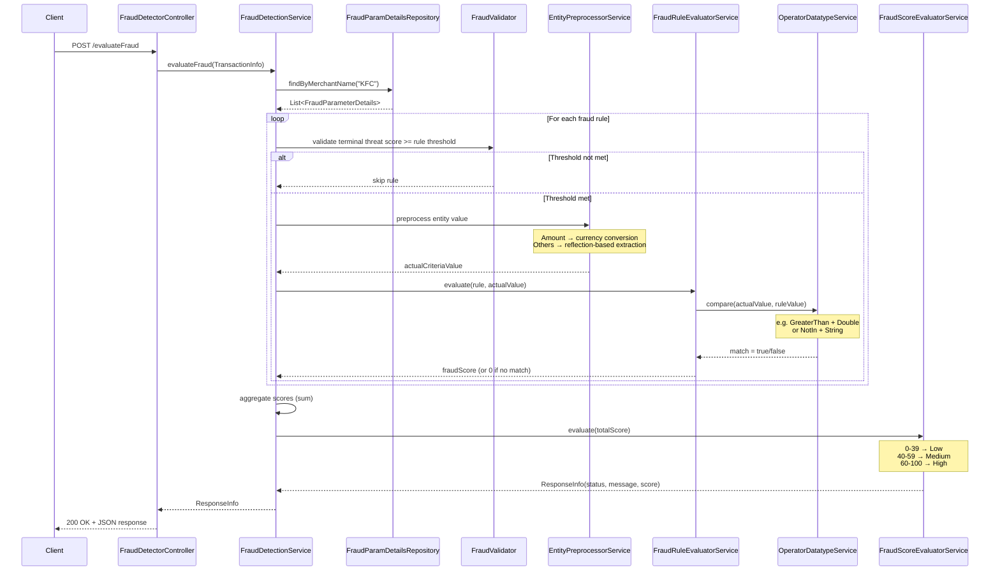
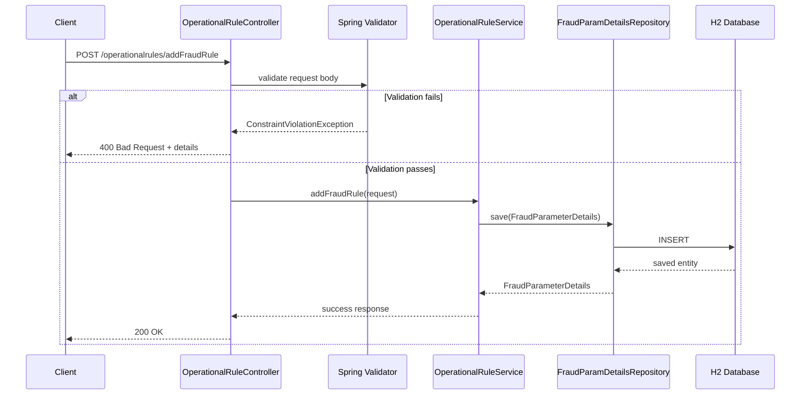
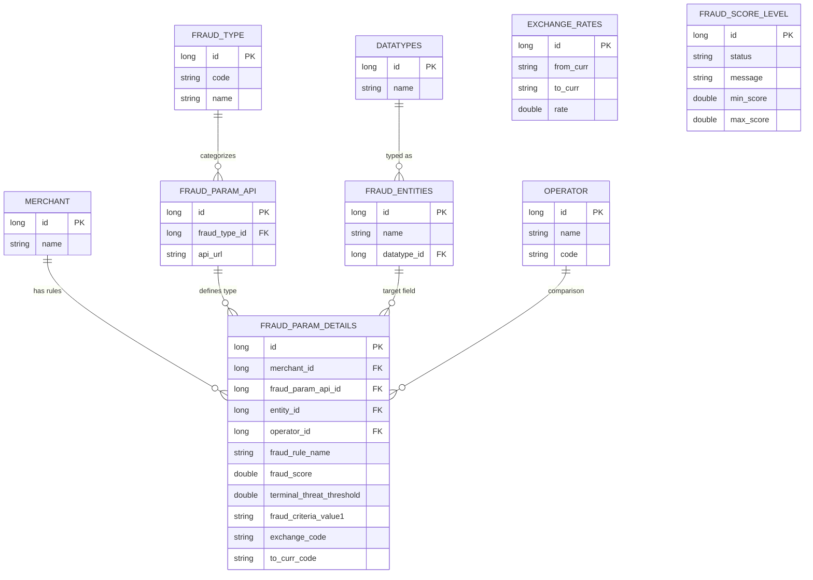

# Fraud Detection Service

A rule-based fraud detection system built with Spring Boot. Transactions come in, get evaluated against configurable per-merchant fraud rules, and receive a risk score (Low / Medium / High).

The system uses the Strategy pattern for operators, preprocessors, and evaluators, making it straightforward to add new fraud rule types without touching existing code.

## Tech Stack

- Java 21 (LTS)
- Spring Boot 3.4.4
- H2 In-Memory Database
- Liquibase (database migrations)
- Spring Data JPA / Hibernate
- Log4j2
- Springdoc OpenAPI (Swagger UI)
- Maven

## Architecture Overview

```
┌─────────────────────────────────────────────────────────────────────┐
│                         REST Controllers                            │
│  FraudDetectorController          OperationalRuleController         │
└──────────┬──────────────────────────────────┬───────────────────────┘
           │                                  │
           ▼                                  ▼
┌─────────────────────┐           ┌───────────────────────┐
│ FraudDetectionService│           │ OperationalRuleService │
│  (orchestrator)      │           │  (CRUD for rules)      │
└──────┬───────────────┘           └───────────────────────┘
       │
       ├──► FraudValidator (threshold gating)
       │
       ├──► EntityPreprocessorService ──► AmountPreprocessor (currency conversion)
       │                               └► DefaultPreprocessor (reflection-based)
       │
       ├──► FraudRuleEvaluatorService ──► OperationalFraudEvaluatorImpl
       │                               └► (future: Behavioral, Velocity, Geo)
       │
       ├──► OperatorDatatypeService ──► GreaterThanOperatorDouble
       │                             ├► EqualOperatorString
       │                             ├► InOperatorString
       │                             ├► NotInOperatorString
       │                             └► LikeOperatorString
       │
       └──► FraudScoreEvaluatorService (score → risk level mapping)
```

## Fraud Evaluation Flow

This is the core flow. A transaction comes in, gets evaluated against all matching rules for that merchant, and returns a risk assessment.



## Rule Management Flow

Fraud rules are stored per merchant and can be managed through the operational rules API.



## Database Schema



## Project Structure

```
src/main/java/com/frauddetection/
├── config/                     # Spring configs, registry beans
├── controller/                 # REST endpoints
├── dto/                        # Request/response DTOs (Java records)
├── enums/                      # Type-safe enums (FraudTypeCode, EntityType, OperatorType, DataTypeEnum)
├── exception/                  # Custom exception handling
├── model/                      # JPA entities
├── repository/                 # Spring Data JPA repositories
├── service/
│   ├── fraud/                  # Core fraud detection orchestration
│   │   └── operational/        # Operational fraud evaluator
│   ├── operator/               # Operator strategy implementations
│   │   └── impl/               # GreaterThan, Equal, In, NotIn, Like
│   └── preprocessing/          # Entity value preprocessors
├── utils/                      # Utility classes
└── validation/                 # Custom validators
```

## Design Patterns

- **Strategy**: Each operator (GreaterThan, In, NotIn, etc.) and preprocessor (Amount, Default) is a separate implementation behind a common interface. New ones can be added without modifying existing code.
- **Registry**: Spring-managed maps wire `(OperatorType, DataType)` pairs to their implementations at startup. Same approach for fraud evaluators and entity preprocessors.
- **Template Method**: `BaseEntity` provides common audit fields (created_at, updated_at) across all entities.

## Getting Started

```bash
# clone the repo
git clone <repo-url>
cd FraudDetection

# build
mvn clean install

# run
mvn spring-boot:run
```

The app starts on `http://localhost:8080`. Swagger UI is at `http://localhost:8080/swagger-ui/index.html`. H2 console is at `http://localhost:8080/h2-console` (JDBC URL: `jdbc:h2:mem:frauddetection`).

Liquibase creates the schema and seeds it with sample merchants, operators, and two fraud rules for the "KFC" merchant.

## API Endpoints

### Evaluate Fraud

`POST /evaluateFraud`

Evaluates a transaction against all fraud rules configured for the given merchant.

Request:
```json
{
  "amount": 600,
  "currency": "EUR",
  "terminalId": "123",
  "merchant": "KFC",
  "terminalThreatScore": "80"
}
```

Response (`200 OK`):
```json
{
  "status": "H",
  "message": "High",
  "fraudScore": "75.0"
}
```

### Add Fraud Rule

`POST /operationalrules/addFraudRule`

```json
{
  "merchant": { "id": 1, "name": "KFC" },
  "fraudParameterApi": { "id": 1 },
  "entity": { "id": 1 },
  "operator": { "id": 3 },
  "fraudRuleName": "MaxTransAmount",
  "fraudScore": 33,
  "terminalThreadThreshold": 45,
  "fraudCriteriaValue1": "30",
  "exchangeCode": "ABC",
  "toCurrCode": "USD"
}
```

Responses: `200 OK` on success, `400 Bad Request` with validation details on failure.

### Update Fraud Rule

`POST /operationalrules/updateFraudRule`

```json
{
  "merchant": { "id": 1, "name": "KFC" },
  "fraudRuleName": "MaxTransAmount",
  "fraudScore": 33
}
```

### Delete Fraud Rule

`POST /operationalrules/deleteFraudRule`

```json
{
  "merchant": { "id": 1, "name": "KFC" },
  "fraudRuleName": "MaxTransAmount"
}
```

## Sample Rules (Seeded)

| Rule | Entity | Operator | Criteria | Score | Threshold |
|------|--------|----------|----------|-------|-----------|
| MaxTransAmount | amount (Double) | Greater Than | 500 USD | 40 | 61 |
| ValidTerminalIds | terminalId (String) | Not In | 123,456,333 | 50 | 50 |

## Score Levels

| Status | Level | Score Range |
|--------|-------|-------------|
| L | Low | 0 - 39 |
| M | Medium | 40 - 59 |
| H | High | 60 - 100 |

## Extending the System

**Add a new operator**: Implement the `OperatorDatatype` interface, then register the `(OperatorType, DataTypeEnum)` pair in `OperatorDatatypeRegistry`.

**Add a new fraud type** (e.g., Velocity): Implement `FraudRuleEvaluator`, register it in `FraudRuleEvaluatorRegistry` against the new `FraudTypeCode`.

**Add a new entity preprocessor**: Implement `EntityPreprocessor`, register it in `EntityPreprocessorRegistry` for the target `EntityType`.
