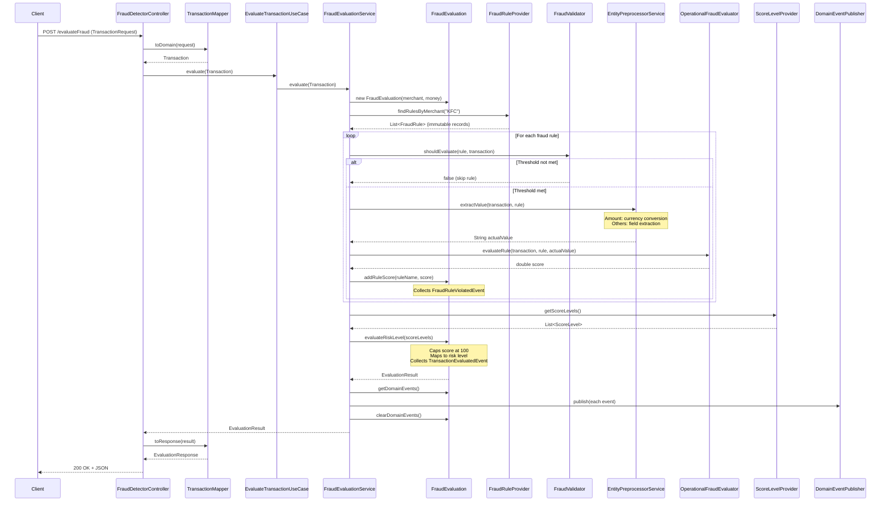

# Fraud Detection Service

A rule-based fraud detection system built with Spring Boot, structured using Hexagonal Architecture (Ports & Adapters). Transactions come in, get evaluated against per-merchant fraud rules, and receive a risk score (Low / Medium / High).

## Tech Stack

- Java 21 (LTS)
- Spring Boot 3.4.4
- YAML-based configuration (`@ConfigurationProperties`)
- Log4j2
- Springdoc OpenAPI (Swagger UI)
- 34 unit tests (all passing)

## Architecture

This project follows **Hexagonal Architecture** (Ports & Adapters), originally described by Alistair Cockburn. The core idea: business logic sits at the center with no knowledge of infrastructure. All external concerns (REST, YAML config, Spring events) connect through port interfaces.

### The Hexagon

The domain layer is pure Java. No Spring annotations, no framework imports, no infrastructure coupling. It contains:

- **Domain models** as immutable records (`Transaction`, `FraudRule`, `ScoreLevel`, `ExchangeRate`)
- **Value objects** (`Money`, `RiskLevel`, `RuleViolation`, `EvaluationResult`)
- **Aggregate** (`FraudEvaluation`) with real behavior: score accumulation, risk level evaluation, domain event collection
- **Domain services** (`FraudRuleEvaluator`, `FraudValidator`, preprocessors, operators)
- **Domain events** (`TransactionEvaluatedEvent`, `FraudRuleViolatedEvent`)

### Ports

Port interfaces define what the domain needs from the outside world. The domain depends only on these abstractions.

**Input port (driving):**
- `EvaluateTransactionUseCase` - the single entry point for fraud evaluation

**Output ports (driven):**
- `FraudRuleProvider` - load fraud rules by merchant
- `ExchangeRateProvider` - look up exchange rates for currency conversion
- `ScoreLevelProvider` - load score-to-risk-level mappings
- `DomainEventPublisher` - publish domain events after evaluation

### Adapters

Adapters implement ports and translate between external formats and domain types.

**Input adapter (REST):**
- `FraudDetectorController` - receives HTTP requests, converts DTOs to domain types via `TransactionMapper`, delegates to the input port
- `TransactionMapper` - anti-corruption layer between REST DTOs and domain models

**Output adapters (YAML config + Spring events):**
- `YamlFraudRuleProvider` - reads `FraudDetectionProperties`, converts mutable POJOs to immutable `FraudRule` records
- `YamlExchangeRateProvider` - reads exchange rate config, returns `Optional<ExchangeRate>`
- `YamlScoreLevelProvider` - reads score level config, returns domain `ScoreLevel` records
- `SpringDomainEventPublisher` - wraps Spring's `ApplicationEventPublisher`

### Dependency Direction

Dependencies point inward. The domain imports nothing from adapters or Spring framework.

```
adapter/in/rest  ──┐
                    ├──► application/ ──► domain/
adapter/out/     ──┘          │              ▲
                              └──► port/ ────┘
```

## Architecture Diagram

```
                      ┌─────────────────────────────────────┐
                      │           REST Adapter (in)         │
                      │  FraudDetectorController            │
                      │  TransactionMapper                  │
                      │  TransactionRequest / Response DTOs │
                      └──────────────┬──────────────────────┘
                                     │
                          ┌──────────▼──────────┐
                          │   «input port»      │
                          │ EvaluateTransaction  │
                          │     UseCase          │
                          └──────────┬──────────┘
                                     │
                      ┌──────────────▼──────────────────┐
                      │       Application Service       │
                      │     FraudEvaluationService      │
                      └──┬────┬────┬────────────────────┘
                         │    │    │
           ┌─────────────┘    │    └──────────────┐
           ▼                  ▼                   ▼
  ┌────────────────┐ ┌───────────────┐  ┌─────────────────┐
  │ «output port»  │ │ «output port» │  │  «output port»  │
  │FraudRuleProvider│ │ScoreLevel     │  │DomainEvent      │
  │ExchangeRate    │ │   Provider    │  │   Publisher     │
  │   Provider     │ │               │  │                 │
  └───────┬────────┘ └──────┬────────┘  └────────┬────────┘
          │                 │                    │
          ▼                 ▼                    ▼
  ┌───────────────┐ ┌───────────────┐  ┌──────────────────┐
  │ YAML Adapter  │ │ YAML Adapter  │  │ Spring Adapter   │
  │YamlFraudRule  │ │YamlScoreLevel │  │SpringDomainEvent │
  │  Provider     │ │  Provider     │  │  Publisher       │
  │YamlExchange   │ │               │  │                  │
  │ RateProvider  │ │               │  │                  │
  └───────────────┘ └───────────────┘  └──────────────────┘
```

## Fraud Evaluation Flow


```mermaid
sequenceDiagram
    participant Client
    participant Controller as FraudDetectorController
    participant Mapper as TransactionMapper
    participant UseCase as EvaluateTransactionUseCase
    participant Service as FraudEvaluationService
    participant Aggregate as FraudEvaluation
    participant RulePort as FraudRuleProvider
    participant Validator as FraudValidator
    participant Preprocessor as EntityPreprocessorService
    participant Evaluator as OperationalFraudEvaluator
    participant ScorePort as ScoreLevelProvider
    participant EventPort as DomainEventPublisher

    Client->>Controller: POST /evaluateFraud (TransactionRequest)
    Controller->>Mapper: toDomain(request)
    Mapper-->>Controller: Transaction
    Controller->>UseCase: evaluate(Transaction)

    UseCase->>Service: evaluate(Transaction)
    Service->>Aggregate: new FraudEvaluation(merchant, money)

    Service->>RulePort: findRulesByMerchant("KFC")
    RulePort-->>Service: List<FraudRule> (immutable records)

    loop For each fraud rule
        Service->>Validator: shouldEvaluate(rule, transaction)
        alt Threshold not met
            Validator-->>Service: false (skip rule)
        else Threshold met
            Service->>Preprocessor: extractValue(transaction, rule)
            Note over Preprocessor: Amount: currency conversion<br/>Others: field extraction
            Preprocessor-->>Service: String actualValue

            Service->>Evaluator: evaluateRule(transaction, rule, actualValue)
            Evaluator-->>Service: double score
            Service->>Aggregate: addRuleScore(ruleName, score)
            Note over Aggregate: Collects FraudRuleViolatedEvent
        end
    end

    Service->>ScorePort: getScoreLevels()
    ScorePort-->>Service: List<ScoreLevel>
    Service->>Aggregate: evaluateRiskLevel(scoreLevels)
    Note over Aggregate: Caps score at 100<br/>Maps to risk level<br/>Collects TransactionEvaluatedEvent
    Aggregate-->>Service: EvaluationResult

    Service->>Aggregate: getDomainEvents()
    Service->>EventPort: publish(each event)
    Service->>Aggregate: clearDomainEvents()

    Service-->>Controller: EvaluationResult
    Controller->>Mapper: toResponse(result)
    Mapper-->>Controller: EvaluationResponse
    Controller-->>Client: 200 OK + JSON
```

## Configuration

Fraud rules, score levels, and exchange rates are defined in `application.yml`:

```yaml
fraud-detection:
  rules:
    - name: MaxTransAmount
      merchant: KFC
      fraud-type: OPERATIONAL
      entity-type: amount
      operator-type: GREATER_THAN
      fraud-score: 40
      terminal-threat-threshold: 61
      threshold-value: "500"
      exchange-code: ABC
      to-currency-code: USD
    - name: ValidTerminalIds
      merchant: KFC
      fraud-type: OPERATIONAL
      entity-type: terminalId
      operator-type: NOT_IN
      fraud-score: 50
      terminal-threat-threshold: 50
      threshold-value: "123,456,333"
  score-levels:
    - { code: L, name: Low, min-range: 0, max-range: 39 }
    - { code: M, name: Medium, min-range: 40, max-range: 59 }
    - { code: H, name: High, min-range: 60, max-range: 100 }
  exchange-rates:
    - { exchange-code: ABC, from-currency: EUR, to-currency: USD, rate: 22.3 }
```

## Project Structure

```
src/main/java/com/frauddetection/
├── FraudDetectionApplication.java
│
├── evaluation/                              ← Bounded Context
│   ├── domain/                              ← THE HEXAGON (pure Java, no Spring)
│   │   ├── aggregate/
│   │   │   └── FraudEvaluation.java         (score accumulation, risk eval, event collection)
│   │   ├── model/
│   │   │   ├── Transaction.java             (immutable record)
│   │   │   ├── FraudRule.java               (immutable record)
│   │   │   ├── ScoreLevel.java              (immutable record)
│   │   │   └── ExchangeRate.java            (immutable record)
│   │   ├── valueobject/
│   │   │   ├── Money.java
│   │   │   ├── RiskLevel.java
│   │   │   ├── RuleViolation.java
│   │   │   └── EvaluationResult.java
│   │   ├── event/
│   │   │   ├── TransactionEvaluatedEvent.java
│   │   │   └── FraudRuleViolatedEvent.java
│   │   └── service/
│   │       ├── FraudRuleEvaluator.java      (strategy interface)
│   │       ├── OperationalFraudEvaluatorImpl.java
│   │       ├── FraudValidator.java          (threshold gating)
│   │       ├── operator/                    (GreaterThan, Equal, In, NotIn, Like)
│   │       └── preprocessing/              (Amount, Default preprocessors)
│   │
│   ├── port/                                ← PORT INTERFACES
│   │   ├── in/
│   │   │   └── EvaluateTransactionUseCase.java
│   │   └── out/
│   │       ├── FraudRuleProvider.java
│   │       ├── ExchangeRateProvider.java
│   │       ├── ScoreLevelProvider.java
│   │       └── DomainEventPublisher.java
│   │
│   ├── application/                         ← USE CASE IMPLEMENTATION
│   │   └── FraudEvaluationService.java      (orchestrates evaluation via ports)
│   │
│   └── adapter/                             ← INFRASTRUCTURE ADAPTERS
│       ├── in/rest/
│       │   ├── FraudDetectorController.java
│       │   ├── TransactionMapper.java       (anti-corruption layer)
│       │   ├── TransactionRequest.java      (DTO)
│       │   ├── EvaluationResponse.java      (DTO)
│       │   └── TerminalThreatScoreValidator.java
│       └── out/
│           ├── config/
│           │   ├── FraudDetectionProperties.java  (@ConfigurationProperties)
│           │   ├── FraudRuleProperties.java       (mutable POJO for YAML binding)
│           │   ├── YamlFraudRuleProvider.java     (POJO → immutable record)
│           │   ├── YamlExchangeRateProvider.java
│           │   └── YamlScoreLevelProvider.java
│           └── event/
│               └── SpringDomainEventPublisher.java
│
└── shared/                                  ← Shared Kernel
    ├── domain/event/
    │   └── DomainEvent.java                 (abstract base)
    ├── enums/
    ├── exception/
    ├── infrastructure/config/
    │   └── DomainEventListener.java         (audit logging)
    └── registry/                            (strategy registries)
```

## Design Patterns

- **Hexagonal Architecture (Ports & Adapters)**: Domain logic is isolated behind port interfaces. All infrastructure concerns (REST, YAML config, Spring events) live in adapter implementations. The domain has zero Spring framework imports.
- **Anti-Corruption Layer**: `TransactionMapper` sits between REST DTOs and domain types, preventing Swagger/Jackson annotations from leaking into the domain.
- **Strategy**: Each operator (GreaterThan, In, NotIn, etc.) and preprocessor (Amount, Default) is a separate implementation behind a common interface.
- **Registry**: Spring-managed maps wire `(OperatorType, DataType)` pairs to their implementations at startup. Same approach for entity preprocessors.
- **Collect-and-Flush Events**: The `FraudEvaluation` aggregate collects domain events internally during evaluation. The application service flushes them through the `DomainEventPublisher` port after the aggregate finishes its work.
- **Immutable Domain Models**: All domain models (`FraudRule`, `Transaction`, `ScoreLevel`, `ExchangeRate`) are Java records. The mutable `FraudRuleProperties` POJO exists only in the YAML adapter for config binding, and gets converted to an immutable record at the anti-corruption boundary.

## Getting Started

```bash
# clone the repo
git clone <repo-url>
cd FraudDetection

# build
mvn clean install

# run
mvn spring-boot:run
```

The app starts on `http://localhost:8080`. Swagger UI is at `http://localhost:8080/swagger-ui/index.html`.

## API

### Evaluate Fraud

`POST /evaluateFraud`

Evaluates a transaction against all fraud rules configured for the given merchant.

Request:
```json
{
  "amount": 600,
  "currency": "EUR",
  "terminalId": "123",
  "merchant": "KFC",
  "terminalThreatScore": "80"
}
```

Response (`200 OK`):
```json
{
  "status": "H",
  "message": "High",
  "fraudScore": "75.0"
}
```

## Configured Rules

| Rule | Entity | Operator | Threshold Value | Score | Terminal Threshold |
|------|--------|----------|-----------------|-------|--------------------|
| MaxTransAmount | amount (Double) | Greater Than | 500 USD | 40 | 61 |
| ValidTerminalIds | terminalId (String) | Not In | 123,456,333 | 50 | 50 |

## Score Levels

| Status | Level | Score Range |
|--------|-------|-------------|
| L | Low | 0 - 39 |
| M | Medium | 40 - 59 |
| H | High | 60 - 100 |

## Extending the System

**Add a new operator**: Implement the `OperatorDatatype` interface, then register the `(OperatorType, DataTypeEnum)` pair in `OperatorDatatypeRegistry`.

**Add a new entity preprocessor**: Implement `EntityPreprocessor`, register it in `EntityPreprocessorRegistry` for the target `EntityType`.

**Add a new fraud rule**: Add a new entry under `fraud-detection.rules` in `application.yml`.

**Swap the config source**: To load rules from a database instead of YAML, implement `FraudRuleProvider`, `ExchangeRateProvider`, and `ScoreLevelProvider` with JPA-backed adapters. The domain and application layers stay untouched.
